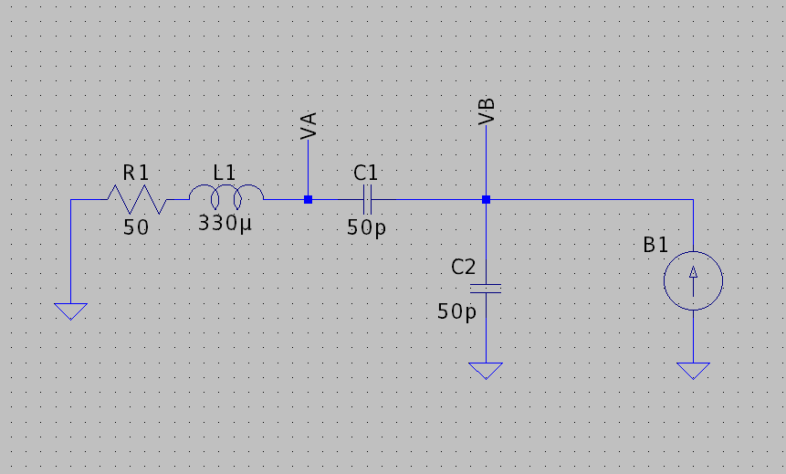
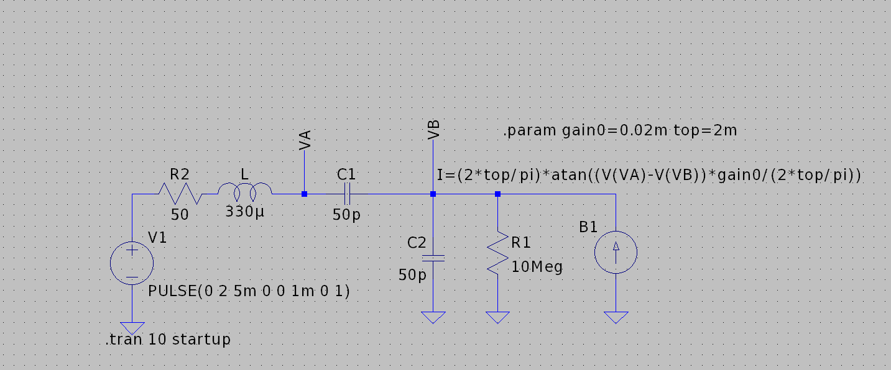
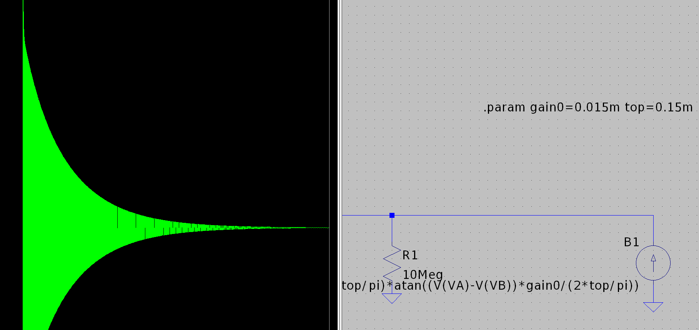

# Colpitts Basics

## The Model
The basic model I'm using to understand the oscillation of the colpitt's oscillator is what I think to be a more complete form of the one found on [Wikipedia](https://en.wikipedia.org/wiki/Colpitts_oscillator).

The difference is that while Wikipedia assumes the existence of the inductor which forms the LC tank circuit, I'm putting it in explicitly.  I also am putting in a resistor in series with the inductor, allowing for the Colpitt's oscillator to lose energy to resistive elements as it would in a normal circuit.  This is because  what I want to determine is exactly what makes the circuit oscillate.

## Create files and folders

It's interesting to think about what happens at the moment a Colpitt's oscillator is connected to power.  The circuit seems to build up an oscillation is interesting.  Of course there are radio signals all around us, and also noise emmanating from all components, which can serve as the initial source.  Of course, this energy must be compounded by the amplifying element in order for the oscillation to carry on forever, which means the system is unstable. 

This lead me to imagine that a voltage source was responsible for the noise, a source I chose to put at the bottom right node of the circuit

It doesn't matter what the voltage source should look like, the system would have to be unstable, so the transfer function between "V1" and another node in the circuit should have a pole with a positive real part.
To do this I had to do some circuit analysis:

I defined first : $\Delta V = V_A - V_B$
Then I applied KCL to get the following equations:

$$CsV_B = Cs\Delta V + K\Delta V = (Cs + K)\Delta V$$

$$Cs\Delta V = \frac{V_1 - V_A}{Ls + R} = \frac{V_1 - \Delta V - V_B}{Ls + R}$$

Then I got the transfer function:

$$\frac{V_B\left(s\right)}{V_1\left(s\right)} = \frac{Cs + K}{LC^2s^3 + RC^2s^2 + 2Cs + K}$$

Then, after applying the Routh-Hurwitz criterion, I found that instability occurs when:

$$2RC^3 - KLC^2 < 0$$

$$K > \frac{2RC}{L}$$

So for our current example, for an oscillation to be generated K needs to be greater than 0.0152mA/V.

## Simulation

Simulating oscillators can be a little tricky in simulators can be a little tricky, because as I said before a Colpitt's oscillator needs a little bit of energy from external noise to get going, which a simulator can't really provide.  To fix this I just added a small pulse to the circuit.

Another issue is the fact that for a Colpitt's oscillator to work in real life, the current amplifying component must saturate (there must be a current limit / the gain must decrease to 0).  Obviously in real life BJTs saturate.  In order to do this and still demonstrate the concept, I came up with a play function which smoothly trends towards a maximum current $I_{\text{max}}$.  In the SPICE simulation below I replaced our current source $I = K(V_A - V_B)$, with another function:

$$ I = \frac{2I_{\text{max}}}{\pi}\tan^{-1}{\left(K\pi\frac{\left(V_A - V_B\right)}{2I_{\text{max}}}\right)} $$

In order to make the simulation work, I also had to add a large resistor in parallel with the current source.

For practical purposes, I just set $I_\text{max}$ to 10 times K.

Since we know that the criteria for oscillation with these chosen values is $K > 0.0152mA/V$.  I tried the values around that point.

With K = 0.015mA/V, just under what's required for oscillation, the signal dies out after the step since the system is stable

With K = 0.016mA/V, just over what's required for oscillation, the signal oscillates during and after step for perpituity.