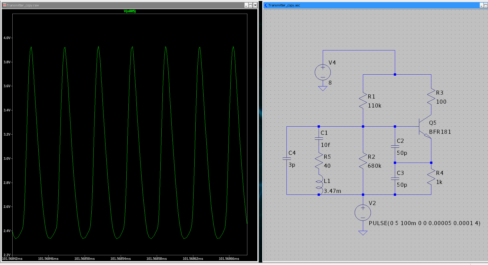

# Now The Crystal

## Intro
The most common crystal oscillator is probably the Pierce oscillator (with use in microcontrollers).  The issue with this is that I wanted something closer to a sinusoid to serve as the basis for my AM modulator.  The crystal I chose to implement in my circuit is a 27 MHz crystal oscillator found on LCSC.  The problem I had after measuring this circuit in real life is that the amplitude was way too high, causing BJT transistor to saturate near the top and the bottom, turning my ideal halfway-close sinusoid into an almost squarewave.  Hopefully the calculations that I did on the general Colpitt's oscillator page will provide me the correct intuition to remedy this issue.

## Crystal Background
A crystal can be modeled as a capacitor in parallel with a series RLC circuit.  There are 2 basic parameters given on the crystal datasheet, the DC resistance and the shunt capacitor (the aforementioned capacitor in parallel).  These parameters are given as 50 ohms and 3 picofarads respectively.  Now, how do I know the values of the series capacitance and inductance.  Well, all I know for sure is the resonant frequency, ~27 MHz, which is given by the equation:

$$\frac{1}{2\pi\sqrt{LC}} = 27 * 10^{6} Hz$$

Now, it could be the case that L is 34.7uH and C is 1pF, or it could be that L is 34.7mH and C is 1fF, it's unclear.  Using internet references, I wanted to keep C in the multiple femtofarad range, so I chose L = 3.47mH and C = 10fF.  At the end of the day all of these capacitor/inductor combinations would result in the same resonant frequency, but drastically change the Q factor.  Intuitively, as we saw in my Colpitts explanation, the Quality factor (that L/R ratio) is very important in determining the current gain.  It could be the case that a higher quality factor means that the necessary current gain is smaller, so a higher base current is necessary for the BJT that level of saturation.  No matter what the explanation, there is some descrepancy, because the simulated circuit that behaved as expected is below. Still, I will be modifying this original circuit in the simulation to get some intuition on how saturation can be avoid.  To this end, it makes sense that I need to decrease the amplitude, and note that the simulated waveform was 1.59V peak-to-peak.

[text](../../Desktop/SpiceCircuits/Transmitter.asc)

## The Quick Fixes

To decrease the amplitude of the oscillator, one thing we can do is change our DC operating point.  If we think about our simple BJT model, the current gain should be proportional to around $\frac{h_{fe}}{r_{\pi}}$.  Moving the DC operating point downwards should decrease K and make it so the signal doesn't need to deviate as far to be adequately saturated.  Changing R1 as below decreased the waveform to ~972mV peak-to-peak with a new DC base current operating point of $14.2\muA$, while the orgiinal operating point was at $32.2\muA$.  Increasing the emitter resistor had a similar effect (decreasing K and shortening distance to saturation), which produced a final peak-to-peak of 1.066V (with a new operating DC base current of $22.12\muA$).

")

Another thing we can do is change the feedback loop through modifying the values of the capacitor voltage divider.  Decreasing the value of C1 (the top capacitor in the voltage divider), will naturally decrease the voltage on C2.  In fact, this might be part of the cause of the discrepancy, as capacitors are notorious for having high tolerances.  Decreasing C1 to 40pF resulted in a new peak-to-peak voltage of 1.09V (a change of 31% which could easily be caused by component tolerance).

")