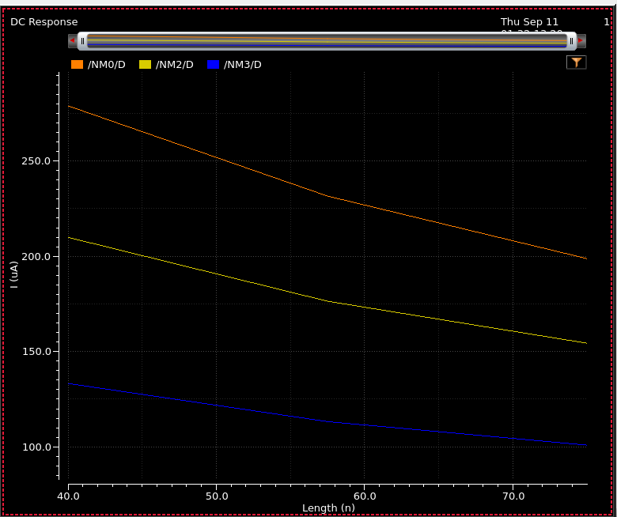

## Testing Foundry Models

Through my Intro to VLSI class I recently got access to Cadence.  The first thing I wanted to do was simulate some basic FET parameters so I can compare the results to the equations given in class.  Things were going good until I stumbled upon this graph:

This shows the saturation current vs Gate Length for three values of Vds (Orange Vds = 2.5V, Yellow Vds = 2.0V, and Blue Vds = 1.5V).  The model I'm using is the 1V NMOS which is part of the 45nm General Process Design Kit (gpdk045 in my Cadence environment).  The typical value of Length not coincidentally 45nm, but I set up a parameter sweep between 40-75nm.

What I was expecting is that the saturation current should be inversely proportional to the gate length, from the equation:

$$I_{ds}=\frac{\beta}{2}(V_{GS}-V_{T})^2$$

where $\beta$ is given by:
$$\beta = \mu C_{ox}\frac{W}{L}$$

Yet the relationship seemed to be strangely linear.  

Something to be noted is that the equation $I_{ds}$ above is just a simplification of another equation:

