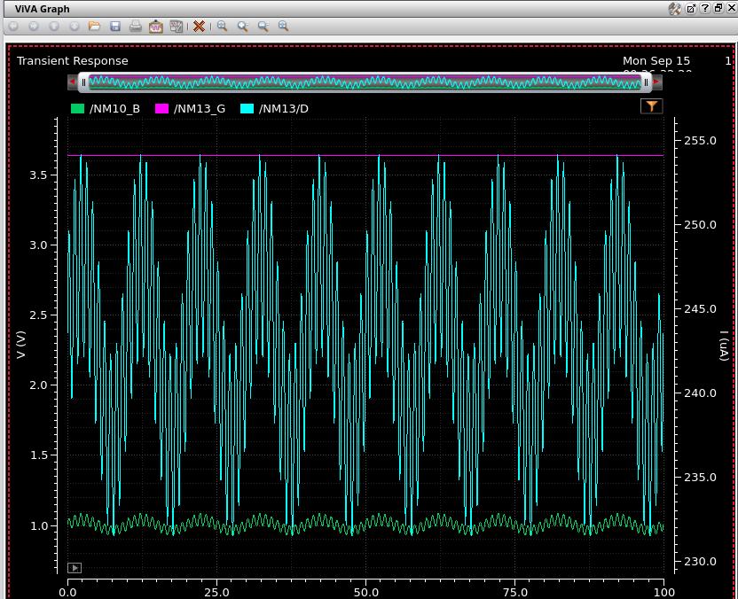
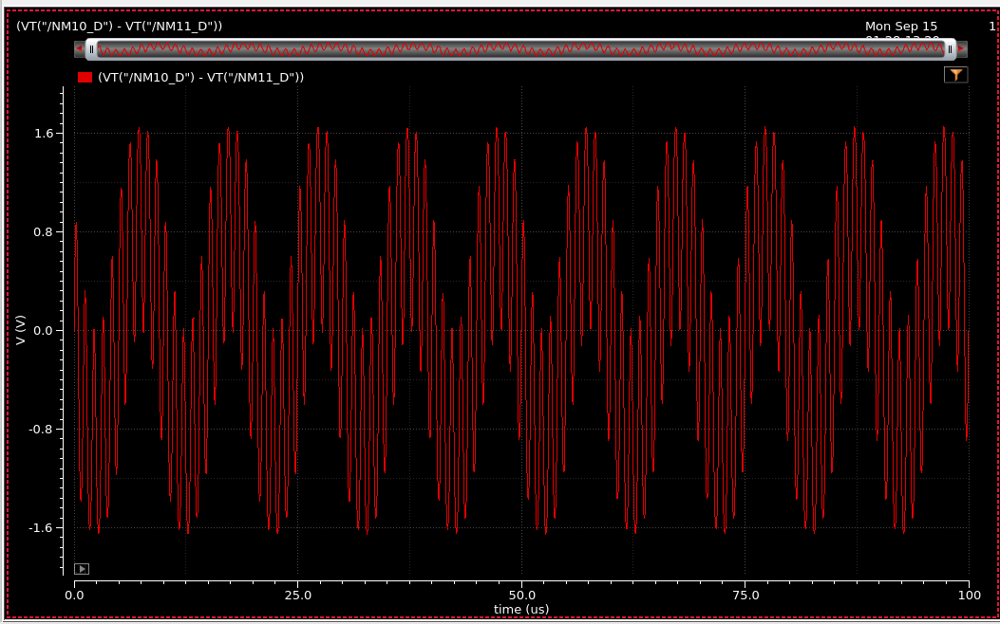
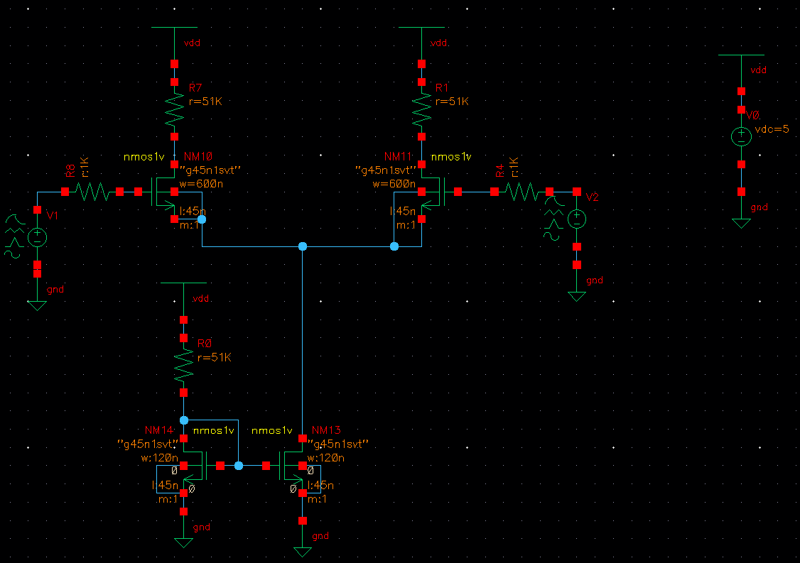
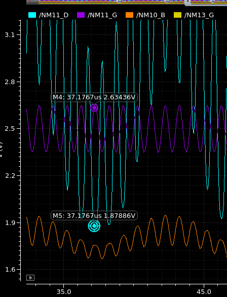
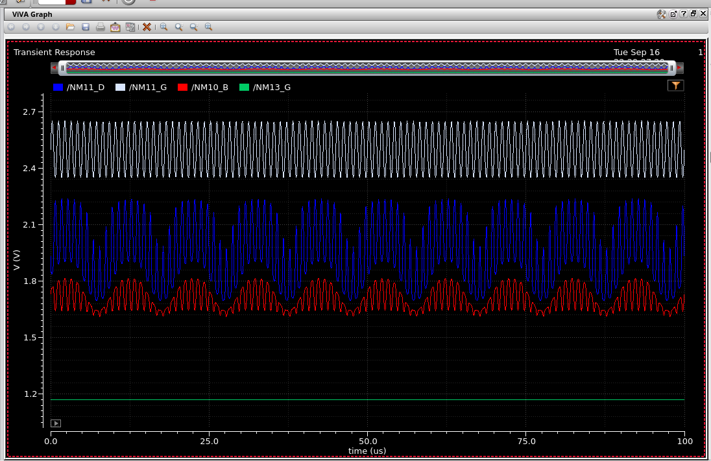
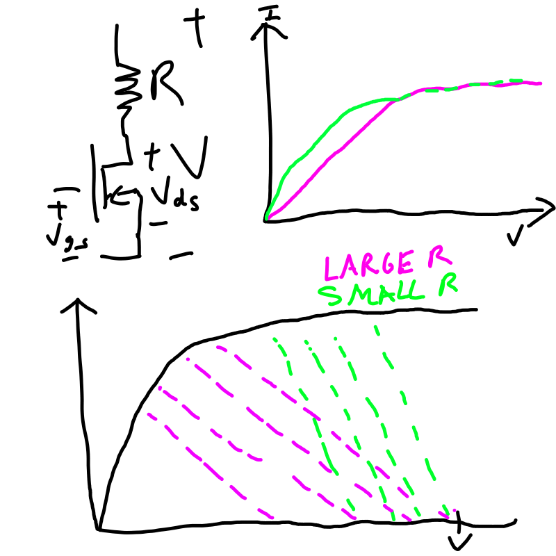

## MOS Differential Amplifier

This circuit is basically a typical MOS differential amplifier where the tail current source is implemented through a Mosfet current mirror.

Assuming both top transistors are in saturation (which I will ensure), we have the equations:

$$I_{d1} = K(V_{gs1}-V_t)^2$$
$$I_{d2} = K(V_{gs2}-V_t)^2$$

Since it's both going to the current source we then have:
$$I_{s} = I_{d1} + I_{d2}$$
and then the voltage difference between the two nodes below R7 and R1, (where R7 and R1 have resistance "R"):

$$V_o = R(I_{d2} - I_{d1})$$

We know that $V_{gs}$ is simply the input voltage minus the voltage at the node above the current source, which I will call $V_{A}$.  Substituting this I get:

$$I_{d1} = K(V_{1}-V_{A}-V_t)^2$$
$$I_{d2} = K(V_{2}-V_{A}-V_t)^2$$

Subtracting the two equations get us:

$$V_o = KR((V_{1} - V_{A} - V_t)^2 - (V_{2} - V{A} - V_t)^2)$$
$$= KR(V_1^2 - V_2^2 + 2(V_2-V_1)(V_{A} + V_t))$$

calculating V_A is a little hard because it's a long quadratic.

On the right, we have the input signals, a 1MHz and a 100kHz signal with amplitude 0.15V.  What's plotted on the left is our differential signal (the difference between the drain voltages).  This circuit provides only a small gain that we want to increase.

Either way, the gain is way too small.  This is due to the bottom MOSFET not being an ideal current source due to operating in the linear region of the MOSFET.  The current on the other side of the current mirror is too high while the W/L ratio is too low (the same as the top FETs 8:3). Funily enough, this allows the MOSFETs at the top to operate in their saturated region.  The fact that the tail MOSFET is in it's linear region is seen below:

Here, the drain to source voltage is considerably lower than the gain to source voltage.

Increasing the W/L ratio to 40:3 still leaves MOSFET in the unsaturated region, and interestingly enough pulls the top FETs into the unsaturated region as well.  Here you can see the top FETs now unsaturated:

Our problem in this circuit is that because the bottom FET's current is so high (it only has a 2K load on current mirror), it's saturation point is too far to the right.  This brings the operating point to the right, making the top and bottom FETs both touch the saturation threshold.  Doing the opposite, increasing the W/L to 40:3 for the top FETs, and increasing our current mirror resistor to 51K, we get the case where all FETs are in saturation.  Our gain has now increased to around ~5.5.  With large amplitude input signals, a great improvement in gain isn't likely.

If we do want to increase the gain, increasing the drain resistors should do the trick given that the FETs remain in saturation.  Barely more than doubling our resistors violates this however, leaving $V_{ds}$ less than our approximate value of $V_{gs} - V_t$.  It should be noted that for this model, our $V_t$ should be approximately 0.65V.

It gets even worse with change to a 75k resistor:

We simply don't have much headroom, this is intuitive, because when viewing the NMOS and resistor as one device, increasing the resistance increases the effective necessary voltage for saturation.  This can be seen in the simplistic diagram below:

One way to increase headroom is to increase the W/L ratio of the FETs, even increasing the W/L ratio for the bottom FET will drop voltage needed for the FET to saturate at that given current.  Simply increasing the W/L of the FETs will not work however if the output is too high, simply because the amount of headroom will always be inversely related to the size of the output.  Increasing the resistance to a certain level just means there will never be enough margin.

Even in this case, increasing the W/L ratio to 66.7 wasn't enough.  Simply the drain resistors are too high for the amplitude of our inputs and our chosen tail current.  Repeating this again for more realistic values with inputs of amplitude 15mV, we can try to find a much higher gain. 

With our resistor option at 50K drain resistors, we get a gain of ~11.4.  

A graph of our differential signal (difference between drain voltages):

To see how far away the circuit is from saturation just look at the graph below:

