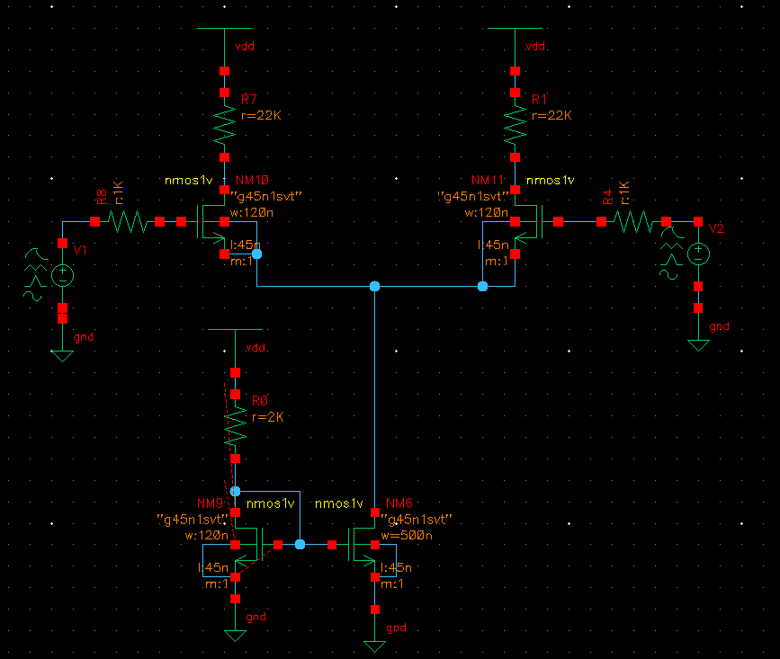
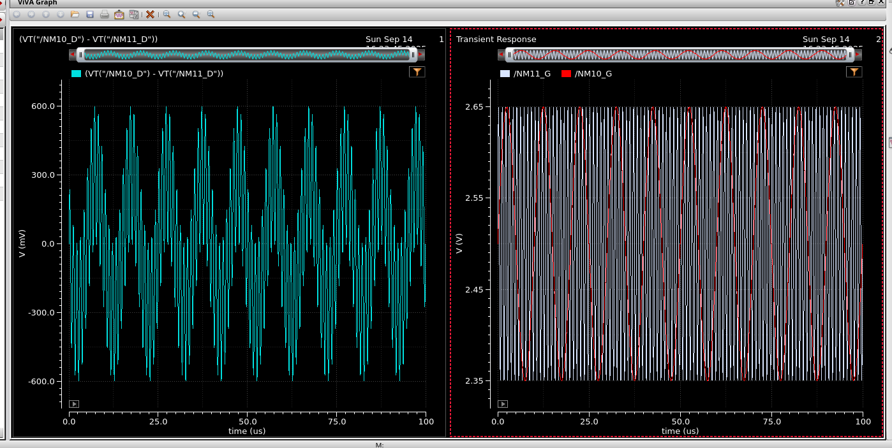

## MOS Differential Amplifier

This circuit is basically a typical MOS differential amplifier where the tail current source is implemented through a Mosfet current mirror.

Assuming both top transistors are in saturation (which I will ensure), we have the equations:

$$I_{d1} = K(V_{gs1}-V_t)^2$$
$$I_{d2} = K(V_{gs2}-V_t)^2$$

Since it's both going to the current source we then have:
$$I_{s} = I_{d1} + I_{d2}$$
and then the voltage difference between the two nodes below R7 and R1, (where R7 and R1 have resistance "R"):

$$V_o = R(I_{d2} - I_{d1})$$

We know that $V_{gs}$ is simply the input voltage minus the voltage at the node above the current source, which I will call $V_{A}$.  Substituting this I get:

$$I_{d1} = K(V_{1}-V_{A}-V_t)^2$$
$$I_{d2} = K(V_{2}-V_{A}-V_t)^2$$

Subtracting the two equations get us:

$$V_o = KR((V_{1} - V_{A} - V_t)^2 - (V_{2} - V{A} - V_t)^2)$$
$$= KR(V_1^2 - V_2^2 + 2(V_2-V_1)(V_{A} + V_t))$$

calculating V_A is a little hard because it's a long quadratic.

On the right, we have the input signals, a 1MHz and a 100kHz signal with amplitude 0.15V.  What's plotted on the left is our differential signal (the difference between the drain voltages).  This circuit provides only a small gain that we want to increase.

Either way, the gain is way too small.  This can be fixed by increasing the current source or by increasing the value of the resistor to vdd.  So for example, quadrupling our W/L ratio and doubling the value of the bottom left resistor (R0), doubles the value of the current source and changes the voltage gain to.

