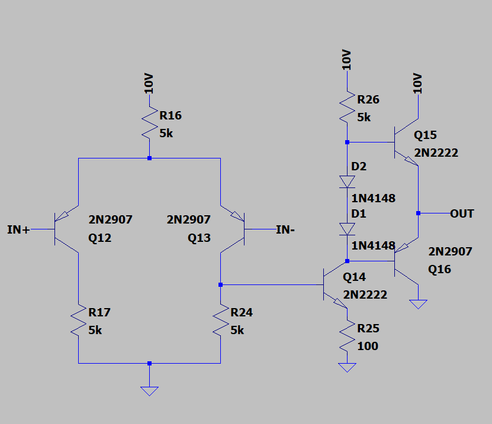

## The Basic Application to an Operation_amplifier circuit

Here is a basic op-amp BJT circuit found from the internet, and it is a good starting point for my analysis:

To test our circuit, I'm going to subtract two 50kHz waveforms:

Examining the currents of transistors Q1 and Q2 given an unbiased configuration we get,
where $V_C$ is the voltage at the emitters (and R is R2 in the image):

$V_C = V_S - R(I_{E1} + I_{E2})$

and from the Eber-Molls model we have again:

$I_E = I_S(e^{\frac{V_{BE}}{V_T}}-1)$ with the yet to be proved assumption $I_E$ is close to $I_C$ for both currents

so $V_C = Vs - I_{S1}R(e^{\frac{V_{V_C-V_{+}}}{V_T}}-1) - I_{S2}R(e^{\frac{V_{V_C-V_{-}}}{V_T}}-1)$

The output of the op-amp is interesting in the small region where $I_{E2}$ is small.