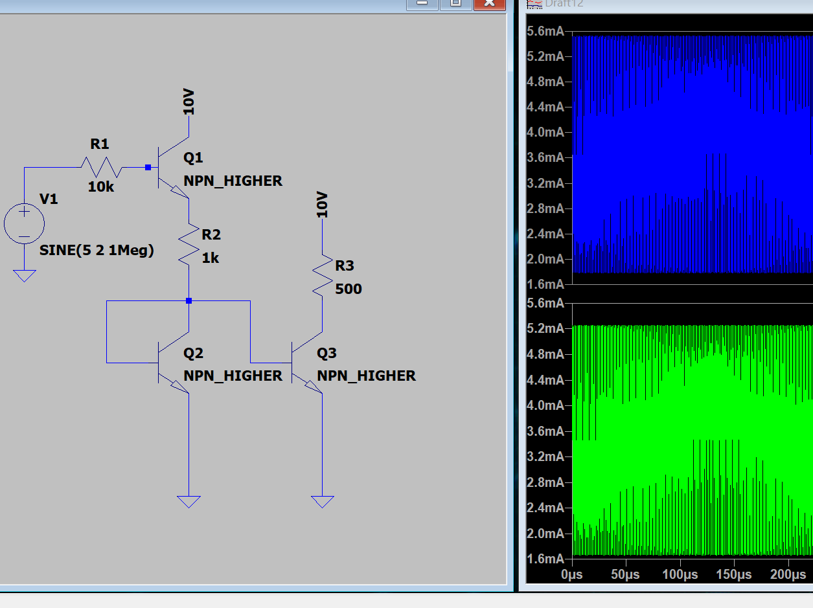
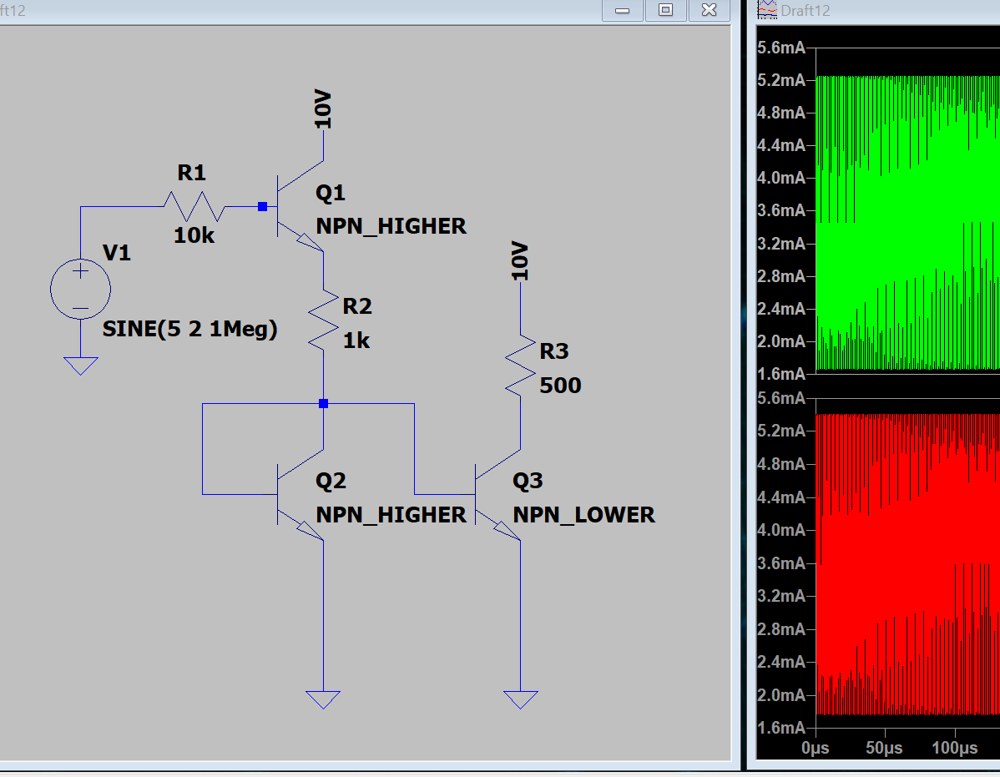
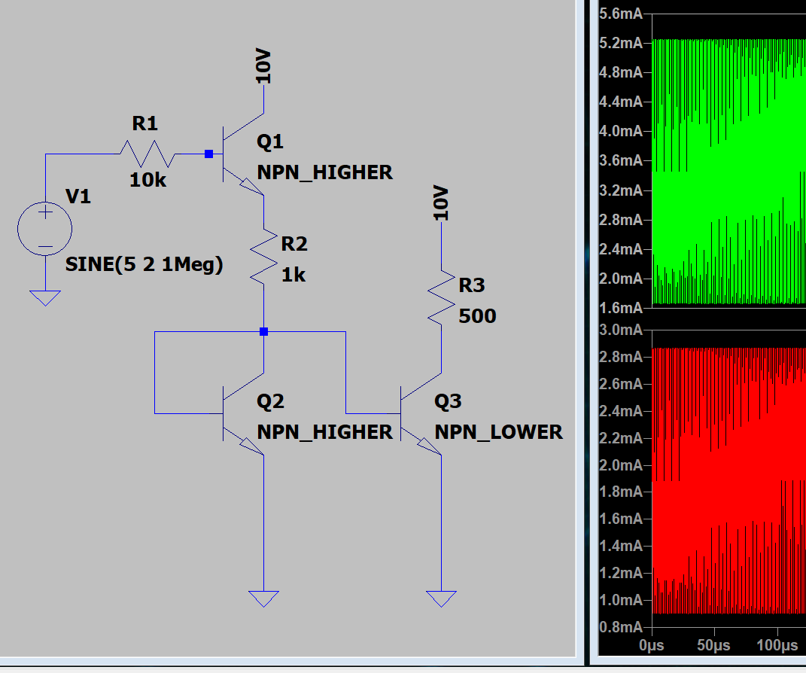
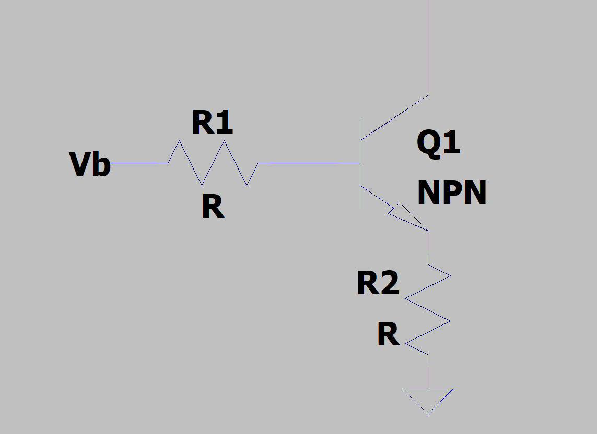
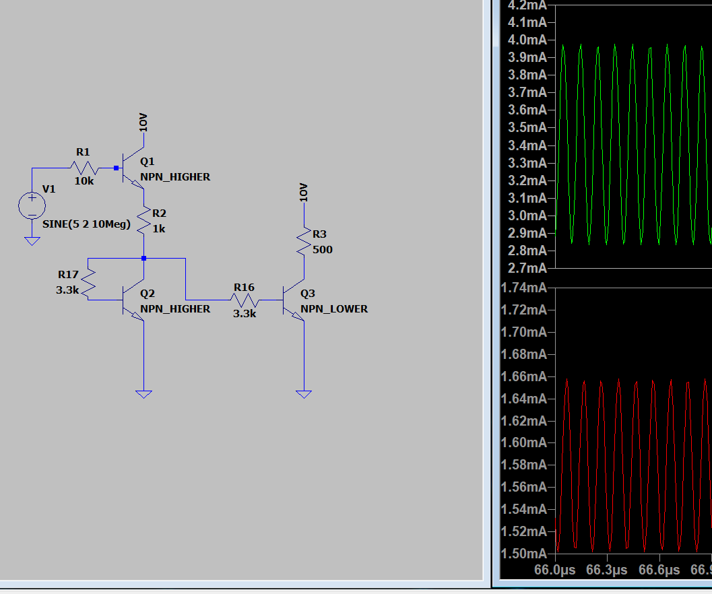
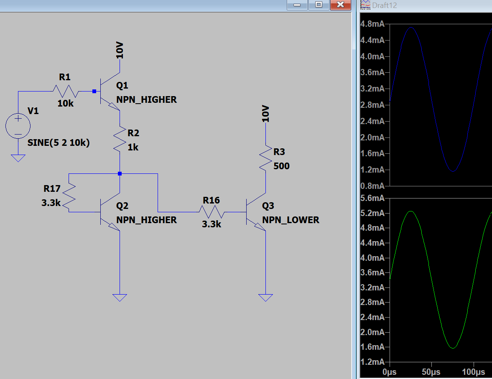
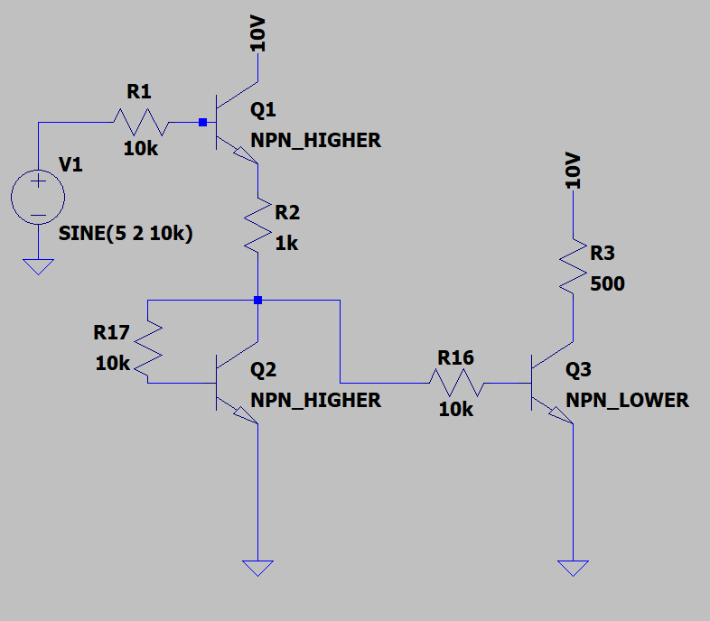

## MODELLING MISMATCHED TRANSISTORS (BJTs)

# Intro
In analog electronics at school, little emphasis is put on transistor mismatch, which can obviously have a drastic impact on our fundamental building blocks (current mirrors, all differential amplifiers, ect.)  I want to do a little bit of my own investigation into how we simulate mismatch, and so a goal is to make a decent operational amplifier (with transistor mismatch in mind).

## Basic Simulation
Before doing anything, I need to figure out how to simulate this in SPICE.  I can easily copy the parameters from a known transistor, I used the 2N2222, and change a few of the parameters.  The main parameter we think about that varies due to manufacturing inconsistencies is the DC current gain, $\beta$.  The default 2N2222 model used in LTSpice has a given $\beta$/BF of 200.  A $\beta$ value this high for such small currents that we will be operating at (<10mA) is a little rediculous.  Analyzing mismatch on this level using the model of a discrete BJT is a little goofy, but I mostly want to demonstrate some principles to myself.

To start, I create a duplicate model of the 2N2222, but changed BF to 80.  The original model I called "NPN_HIGHER" and the new model "NPN_LOWER".  

First, a current mirror with matched transistors:

It's obviously both don't produce identical currents, this is because the current through R2 (the source side current), is not only the Q2 collector current, but the Q3 base current.  So, using our basic linear model of the BJT, we should expect $\frac{I_L}{I_S} = \frac{\beta}{\beta + 2}$, where ($I_L$ is the load current through R3, and $I_S$ is the source current through R2).  So in our case $\beta = 200$, therefore $\frac{I_L}{I_S} = 0.99$, which is somewhat close to our relationship 5.28mA/5.53mA = 0.955.  This is not what I want to study on this page, but worth stating nonetheless.

One might imagine that a mismatch without degeneration resistors would create horrible results, but that's not necessarily the case when we talk about $\beta$! mismatch.

## Why? Revisiting another parameter
Although $\beta$ varies between two BJTs of the same model, another important parameter is the saturation current (or scale current) $I_S.
The importance of $I_S$ can be chiefly found through the Eber-Moll Model:
$I_c = I_s(e^{\frac{V_{BE}}{V_T}}-1)$.

With $I_S$ equal to 1e-14 for NPN_HIGHER, I set $I_S equal to 5e-15 for NPN_LOWER (something which is very well within the realm of possibility due to manufacturing differences).  This change creates a huge difference once implemented, effectively halving the load current.

## Intuition from Mathematics
To understand the relative importance of $I_S$ vs $\beta$, we could apply the Eber-Moll Model to the below circuit.

$I_c = I_s(e^{\frac{V_{BE}}{V_T}}-1)$

*Note that $V_B$ is not simply the voltage at the base terminal.

The Eber-Moll Model is given by:

$I_c = I_S(e^{\frac{V_{BE}}{V_T}}-1)$

From basic analysis we know:

$V_{BE} = V_B - I_BR_1 - I_CR_2$

and assuming active mode: $I_C = \beta I_{B}$

so $I_C = I_S(e^{\frac{V_B - I_C(\frac{R_1}{\beta} + R_2)}{V_T}}-1)$

with the understanding that $\frac{R_1}{\beta} + R_2$ is essentially the equivalent resistance, we substitute it with $R_{eq}$ and make some other simplifications to get:

$I_C = I_Se^{\frac{V_B}{V_T}}e^(-\frac{I_CR_{eq}}{V_T})$

from this is can be shown using W, the Lambert W function:

$I_C = \frac{V_T}{R_{eq}}W(\frac{R_{eq}}{V_T}I_Se^{\frac{V_B}{V_T}})$

This demonstrates the basic behavior that we are getting at, the Lambert W function's derivative is very small and gets smaller as it's argument increases. With some sample values $R_{eq} = 500$, $V_B = 2$, $I_S = 1E-14$, we get an inner argument of ~7.72e23, and W(7.72e23) = 51.  Halfing the value of $I_S$ would decrease the collector current by 1.2%. When $R_{eq}$ is small however, then I_S has a large effect on the collector current.

## MORE RESISTORS
As seen in the previous section, we can alleviate this dependence on $I_S$ by increasing $R_{eq}$, adding some about of base or collector resistance (or both at the same time).  Intuitively, when we increase the emitter resistance, we are essentially biting into the size of our output, because it means the transistor will not be able to support a high current without dipping into cutoff, so it would be better to increase the base resistance.

Looking back at the equation: 
$R_{eq} = \frac{R_1}{\beta} + R_2$, we can see that to get the same effect the resistor $R_1$ must be \beta times larger.  The real beauty in the emitter resistor is not reducing the dependence on $I_S$, but reducing the dependence on $\beta$, as mentioned frequently in school.

Here is the same circuit with mismatched components given a base resistor:

Originally I wanted to look at frequency response with respect to transistor mismatch as well, leading me to choose for input a 1MHz signal, but due to this going forward I will put back in a 10KHz signal. This doesn't have a massive impact, but can change results by nearly 10%.  Here 

As you can see the base resistor is not effective, because although it decreases the dependence on $I_S$, it leaves the dependence on $\beta$ unaffected.  Increasing the $\beta$ of NPN_LOWER back to default, yields a result better than we had in the first case (when $\beta$'s were equal and no base resistor)  Another thing that happens when adding resistor is that due to the parasitic base-emitter and base-collector capacitance, high frequency signals are attenuated (we are basically adding a RC filter).  Originally I wanted to look at frequency response with respect to transistor mismatch as well, leading me to choose for input a 1MHz signal, but due to this going forward I will put back in a 10KHz signal. This doesn't have a massive impact, but can change results by nearly 10%.

If we imagine a world with no $\beta$ variance, and only $I_S$ variance was remaining, results are much better with a 3.3K base resistor:

The difference in DC current as well is eliminated almost entirely when we increase the resistance to 10K:

Reincorperating an emitter resistor, we can see a fix to both our issues, even when adding back the $\beta$ variance:

There will always be some mismatch given component values, doing some circuit analysis we get, even assuming forward voltage $V_{BE}$ is a constant 0.7V, we get (with $I_S$ being the source current to be mirrored, not the physical transistor parameter, and $I_L$ being the load current):
