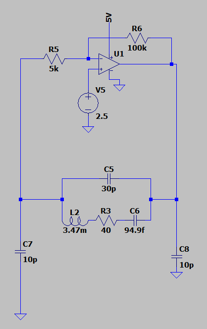

# Colpitts Basics

## The Model

Although A Colpiits Oscillator is typically seen in addition to a microcontroller, where the crystal and capacitor bank is attached to the microcontroller's internal inverter.  The inverter can be replaced by any inverting amplifier (given some parameters are kept in mind).  In this case, I use an op-amp with high enough gain bandwidth, set in the inverting configuration with a gain of 20.  

.

Firstly, we need to look at multiple factors when analyzing the crystal oscillator circuit:

Load Capacitance
ESR (Series Resistance)
and of course the actual resonant frequency

Initial Measuremeents

8.5842654MHz

Pk - Pk = 409.42726mV

gain of 20 on opamp  20 * ln(20) = 59dB

at 8.6 GHz, the input frequency is too high and the CMRR is very low for the op-amp, nonetheless, the op-amp still provides enough negative gain to make the circuit work, and introduce 360 degrees around the loop

