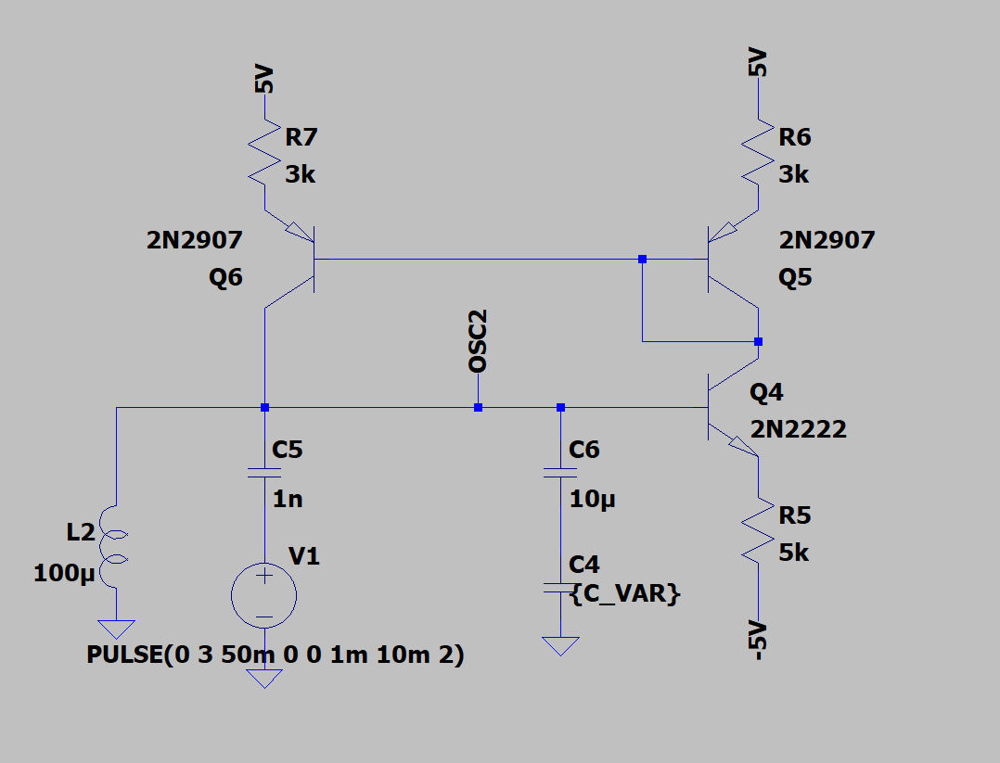
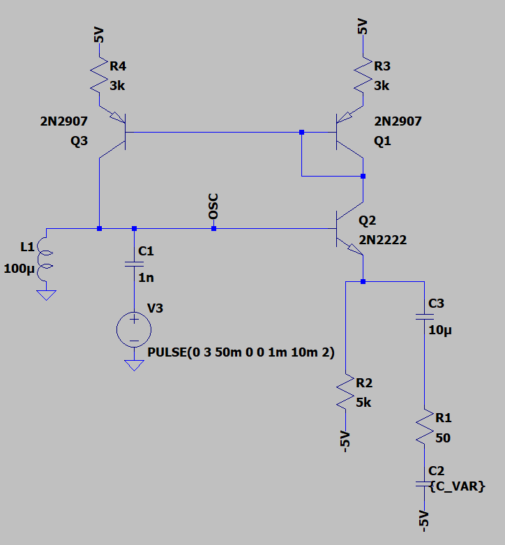
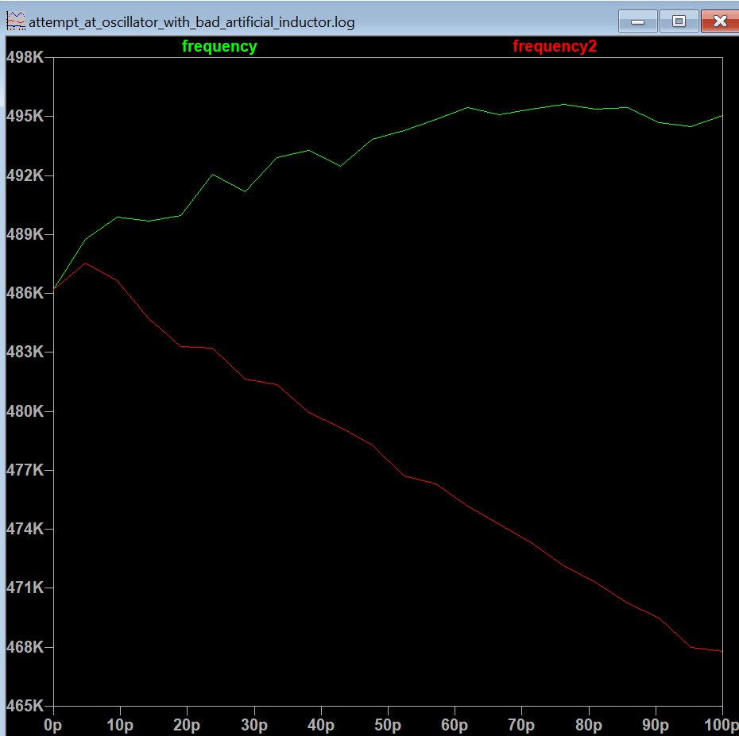
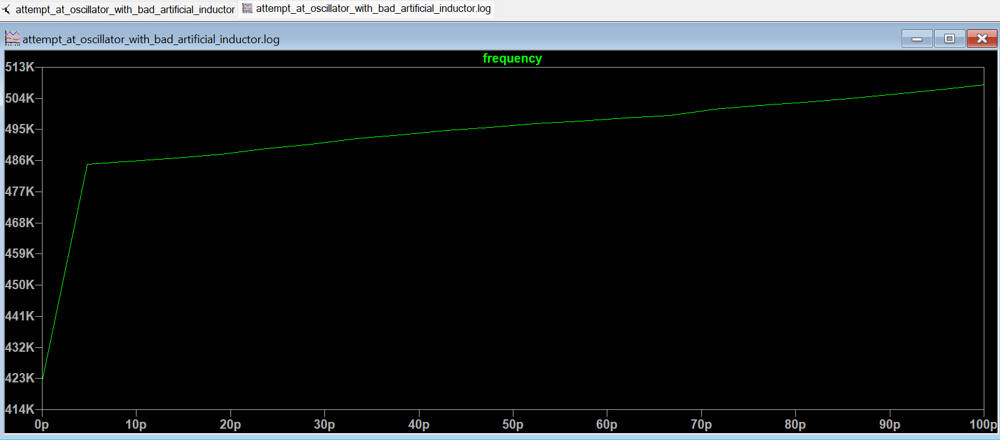
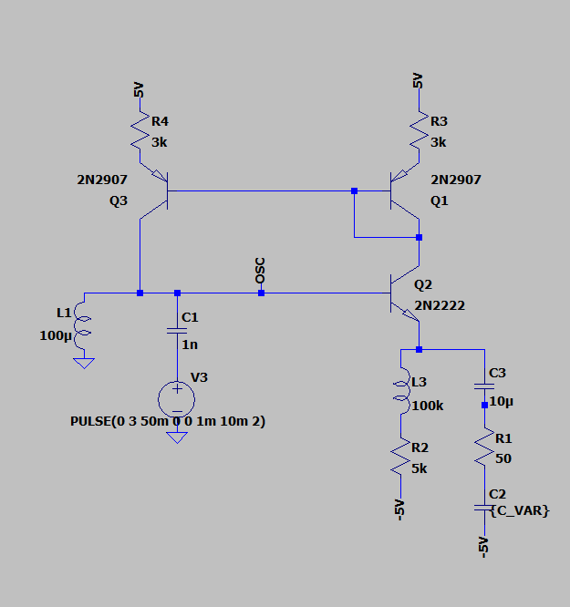
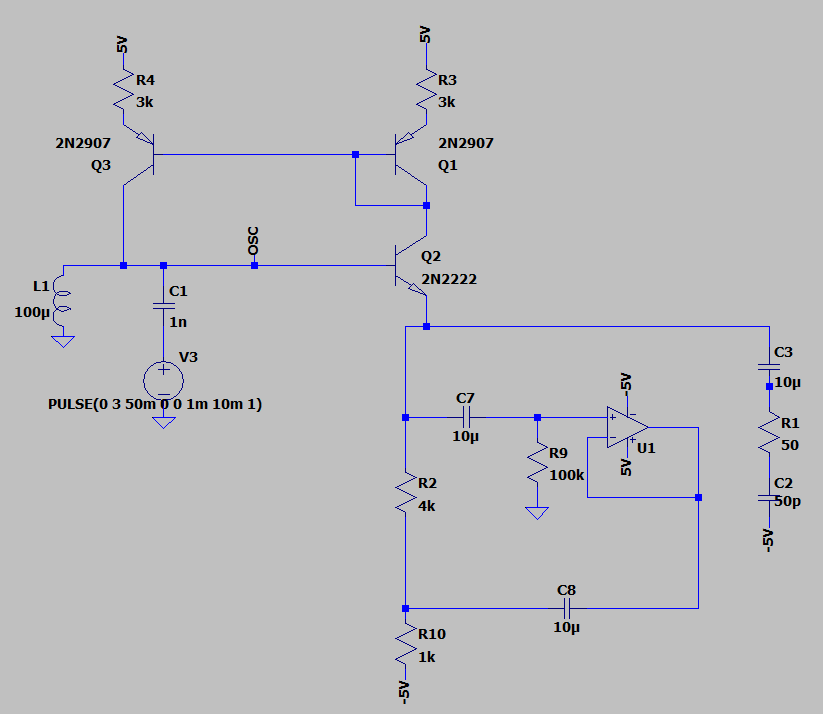
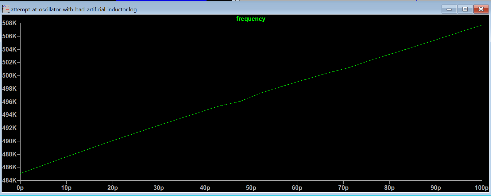

A theremin works because the user controls the characteristic impedance of an antenna by moving their hand between the two rods, essentially the hand forms a variable capacitor.  Our AC model for analysis is simply a 50 ohm resistance in parallel with a 0-100 pF capacitor, with a 10 uF capacitor simply to block DC.  The impedance of the atenna then needs to control the frequency of an oscillator.  An example is here below:

I want the Circuit to oscillate in a high enough frequency range that antenna contruction is feasible, but also low enough that the component values are reasonable and transition frequencies don't get in the way.  So I settled on 500KHz.  Finding an inductor that's adequate is difficult, due to high freequency effects like equivalent parallel capacitance, so I settled on a 100uH inductor.  Then to produce a ~500KHz waveform, I need a 1nF capacitor.  The capacitance range of our antenna model is in the ballpark of 0-100pF.  Which means in the simple parallel configuration, it can decrease our oscillation frequency by at most 4.65% or 23.26KHz.  This is actually really close to spanning the whole audio range, so mixing this directly with a 500KHz waveform, could produce a good audio signal.

There are other ways to do it, where the frequency could increase with capacitance, and we can control the rate of increase.

In our ideal configuration the PNP transistor on the top left provided a current source roughly proportional to the voltage at the LC node, call the gain K.  In this circuit, K increases with frequency, since the current passing through the bottom transistor should be roughly equal to that provided by the PNP on the top-left (through a current mirror).  When the capacitance increases, the capacitance has a larger impact on the network, so higher frequencies have higher gain.  This is my intution for why the frequency increases.  Due to the capacitor being located at the emitter side, it's effective capacitance from the perspective of the base is decreased, which makes the effect very subtle.

We can compare the two strategies with frequency on the y-axis and capacitance on the x-axis.  LT-Spice automatically measured frequency at 22 values between 0-100pF.  

In order to get a linear frequency graph, we need the impedance below the bottom right BJT to decrease linearly with frequency.  This can be achieved if the 5k biasing resistor is an AC open.

Making a true 500kHz AC open is very difficult practically, obviously our simulated 100kH is impossible to recreate in real life.  An ideal 10mH inductor, would only have an impedance of 5k Ohms.  Finding a way to make an AC open circuit is hard, but we will try:

This circuit puts the same AC voltage at the node above R2 to the node below R2, meaning there should be no AC current.  Of course, this is not 100% accurate because of inaccuracies created by the Op-Amp.  Using the simulated AC current and AC voltage, I calculated an impedance |Z| = 37.28k Ohms, which is equivalent to a 74.58mH inductor.

Although it's not perfect, it mantains the linear relationship

